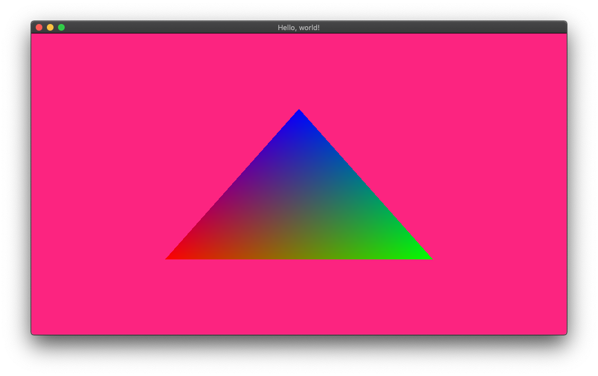

# Render your first triangle

Now you know how to create a _graphics pipeline_ and change the _frame buffer_ background color.
Let’s get to more exciting things, shall we?

We are going to render a single triangle on screen. It will have its _vertices_ with a different
color (one red, one green, one blue) and will be filled by a color gradient between the three
colors. It’s the _Hello, world!_ of graphics libraries.

