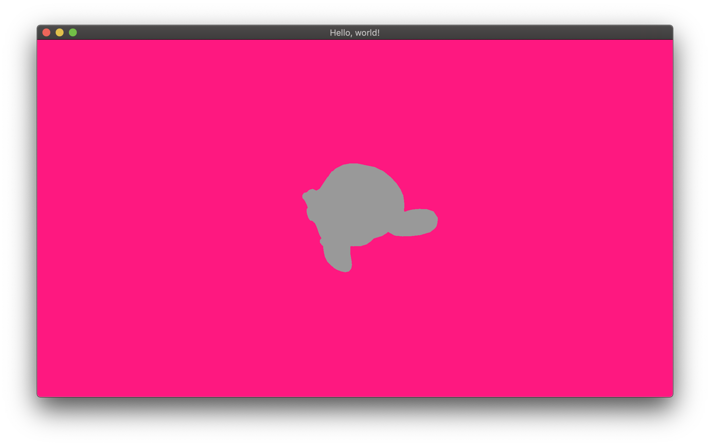

# Altering the graphics pipeline

Now that we have a shader program that can accept updating our two matrices, we need to actually
pass the matrices down to the GPU so that it can use them when transforming points in the _vertex
shader_. That is done via the [`ShadingGate`]. When you call the [`ShadingGate::shade`] method,
you must pass a closure that will receive two arguments:

- A [`RenderGate`], as seen in previous chapters.
- A [`ProgramInterface`], that gives you access to your type (i.e. `ShaderInterface` here).

The [`ProgramInterface`] argument allows you to directly manipulate the fields in your
`ShaderInterface` — here, `projection` and `view`. It also allows other operations on the
[`Program`]’s _uniforms_ but it’s currently off topic — feel free to read its documentation if
you’re interested, though.

[`ProgramInterface`] implements `Deref<Target = ShaderInterface>`, so you can directly select your
fields. You update a uniform by using the [`Uniform::update`] method.

```rust
surface.pipeline_builder().pipeline(&back_buffer, color, |_, mut shd_gate| {
  shd_gate.shade(&program, |iface, mut rdr_gate| {
    iface.projection.update(projection.into()); // here
    iface.view.update(view.into()); // and here

    rdr_gate.render(RenderState::default(), |mut tess_gate| {
      tess_gate.render(mesh.slice(..));
    });
  });
});
```

It’s as simple as that.

> _Why the `.into()` call_?

Because of [cgmath]’s type that must be converted to [`M44`].

If you compile and run with the following
[suzanne.obj](https://phaazon.net/media/uploads/suzanne.obj) file, you should see this:



As you can see, we can guess the monkey silhouette but we don’t actually see any details. In order
to fix that, we will need several things:

- Vertex normals. Those are used to make light rays _bounce_ over the surface of the object and then
  compute angles to determine illumination.
- At least one light, to actually “see” the object.

[luminance]: https://crates.io/crates/luminance
[luminance-derive]: https://crates.io/crates/luminance-derive
[`Vertex`]: https://docs.rs/luminance/latest/luminance/vertex/trait.Vertex.html
[`Semantics`]: https://docs.rs/luminance/latest/luminance/vertex/trait.Semantics.html
[`Tess`]: https://docs.rs/luminance/latest/luminance/tess/struct.Tess.html
[`TessBuilder`]: https://docs.rs/luminance/latest/luminance/tess/struct.TessBuilder.html
[`Mode`]: https://docs.rs/luminance/latest/luminance/tess/enum.Mode.html
[`Pipeline`]: https://docs.rs/luminance/latest/luminance/pipeline/struct.Pipeline.html
[`ShadingGate`]: https://docs.rs/luminance/latest/luminance/pipeline/struct.ShadingGate.html
[`ShadingGate::shade`]: https://docs.rs/luminance/latest/luminance/pipeline/struct.ShadingGate.html#method.shade
[`VertexShader`]: https://docs.rs/luminance/latest/luminance/shader/stage/enum.Type.html#variant.VertexShader
[`FragmentShader`]: https://docs.rs/luminance/latest/luminance/shader/stage/enum.Type.html#variant.FragmentShader
[`Program`]: https://docs.rs/luminance/latest/luminance/shader/program/struct.Program.html
[`RenderGate`]: https://docs.rs/luminance/latest/luminance/pipeline/struct.RenderGate.html
[`TessGate`]: https://docs.rs/luminance/latest/luminance/pipeline/struct.TessGate.html
[Wavefront .obj]: https://en.wikipedia.org/wiki/Wavefront_.obj_file
[wavefront_obj]: https://crates.io/crates/wavefront_obj
[cgmath]: https://crates.io/crates/cgmath
[linear algebra]: https://en.wikipedia.org/wiki/Linear_algebra
[shearing]: https://en.wikipedia.org/wiki/Shear_matrix
[normalized]: http://mathworld.wolfram.com/NormalizedVector.html
[right-handed system]: https://en.wikipedia.org/wiki/Right-hand_rule
[uniform interfaces]: https://docs.rs/luminance/latest/luminance/shader/program/trait.UniformInterface.html
[`Uniform`]: https://docs.rs/luminance/latest/luminance/shader/program/struct.Uniform.html
[`Uniform::update`]: https://docs.rs/luminance/latest/luminance/shader/program/struct.Uniform.html#method.update
[`UniformInterface`]: https://docs.rs/luminance/latest/luminance/shader/program/trait.UniformInterface.html
[contravariant]: https://en.wikipedia.org/wiki/Functor#Covariance_and_contravariance
[`ProgramInterface`]: https://docs.rs/luminance/latest/luminance/shader/program/struct.ProgramInterface.html
[`M44`]: https://docs.rs/luminance/latest/luminance/linear/type.M44.html
[Phong]: https://en.wikipedia.org/wiki/Phong_shading
[try-guard]: https://crates.io/crates/try-guard
