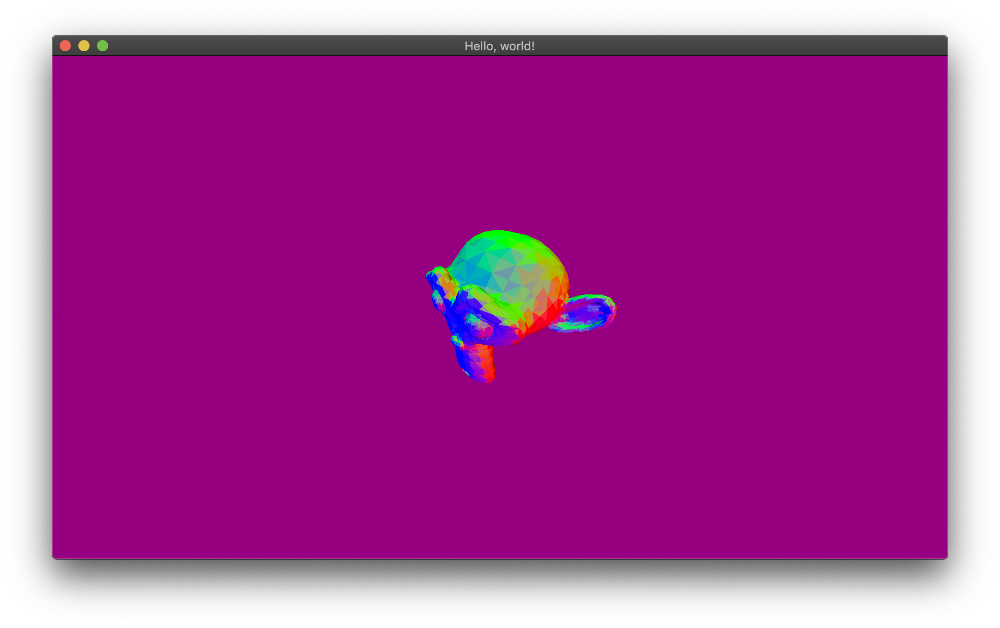

# Adding light

You might be used to it now: if we need vertex normals, we need to change our vertex type
definition.

## Rethinking our vertex type

We need normals, so let’s just state it in our vertex type and semantics!

```rust
#[derive(Clone, Copy, Debug, Eq, Hash, PartialEq, Semantics)]
pub enum VertexSemantics {
  #[sem(name = "position", repr = "[f32; 3]", wrapper = "VertexPosition")]
  Position,
  #[sem(name = "normal", repr = "[f32; 3]", wrapper = "VertexNormal")]
  Normal,
}

#[derive(Clone, Copy, Debug, Vertex)]
#[vertex(sem = "VertexSemantics")]
struct Vertex {
  position: VertexPosition,
  normal: VertexNormal,
}
```

If you try to compile now, you will get an error such as the following:

```
error[E0063]: missing field `normal` in initializer of `Vertex`
   --> src/main.rs:102:26
    |
102 |             let vertex = Vertex { position };
    |                          ^^^^^^ missing `normal`
```

Ah, the beauty of strong-typing. :) Let’s fix our loader!

## Adapting the loading code

Let’s take normals into account when loading objects:

```rust
for shape in geometry.shapes {
  if let obj::Primitive::Triangle(a, b, c) = shape.primitive {
    for key in &[a, b, c] {
      if let Some(vertex_index) = vertex_cache.get(key) {
        indices.push(*vertex_index);
      } else {
        let p = object.vertices[key.0];
        let n = object.normals[key.2.ok_or("missing normal for a vertex".to_owned())?];
        let position = VertexPosition::new([p.x as f32, p.y as f32, p.z as f32]);
        let normal = VertexNormal::new([n.x as f32, n.y as f32, n.z as f32]);
        let vertex = Vertex { position, normal };
        let vertex_index = vertices.len() as VertexIndex;

        vertex_cache.insert(*key, vertex_index);
        vertices.push(vertex);
        indices.push(vertex_index);
      }
    }
  } else {
    return Err("unsupported non-triangle shape".to_owned());
  }
}
```

The main change is this line:

```rust
let n = object.normals[key.2.ok_or("missing normal for a vertex".to_owned())?];
```

Basically, the obj format doesn’t force to use normals, so the normal index is optional. In our
case, we can enforce it this way or we could have a fallback normal that would point in the same
direction for all vertices. Up to you to decide.

## Debugging normals

Let’s make a small and fun debug session to ensure our normals are okay. Modify the vertex and
fragment shader stages to forward the normals and display them.

```glsl
// vertex shader
in vec3 position;
in vec3 normal;

out vec3 v_normal;

uniform mat4 projection;
uniform mat4 view;

void main() {
  v_normal = normal;
  gl_Position = projection * view * vec4(position, 1.);
}
```

```glsl
// fragment shader
in vec3 v_normal;

// we will output a single color
out vec3 frag_color;

void main() {
  // KISS
  frag_color = v_normal;
}
```

Recompile and run. You should have something similar to this:


How fancy! We can see several interesting things here:

- The top of the skull of Suzanne is mostly green. It makes sense because in those positions, the
  vertex normals are roughly `(0, 1, 0)`, which when translated to RGB colors is mostly green.
- The front face is mostly blue, which makes sense too as the normals there are around `(0, 0, 1)`,
  which is blue in RGB encoding.
- The left side (from Suzanne point of view) is mostly red, which makes sense too as it’s
  `(1, 0, 0)` when encoded as RGB.
- You can see that normals here are _smoothly_ interpolated — i.e. you don’t actually see the triangles
  that compose it. This is due to the fact the normals here were generated so that their directions
  generate smooth interpolation across triangles. We could have used flat normals (i.e. face
  normals) instead, or we could also explicitly tell the GPU not to perform interpolation in the
  shaders. You can try it by using `flat out vec3 v_normal;` in the vertex shader and
  `flat in vec3 v_normal;` in the fragment shader.

Face normals here:



## Actually lighting the mesh!

Lighting is now a simple shader concept. Let’s implement a simple lighting effect based on
[directional lighting](https://en.wikipedia.org/wiki/Shading#Directional_lighting). Basically, we can
shade an object by computing the sine of the angles between the light rays and the object normal.
This is called diffused lighting and is an approximation that already gives good results.

The following code is based on the [Phong] illumination model. It’s basic and we know how to do
way better in terms of realism, but for our case, it’s more than enough.

```glsl
in vec3 v_normal;

// we will output a single color
out vec3 frag_color;

void main() {
  // object color
  vec3 obj_color = vec3(.6, .6, .6);

  // light direction
  vec3 light_dir = vec3(0., -1., -.5);

  // diffusion factor (hence the k)
  float kd = dot(v_normal, -light_dir);

  frag_color = obj_color * kd;
}
```

And here’s the result:


Complete code:

```rust
use cgmath::{perspective, EuclideanSpace, Matrix4, Point3, Rad, Vector3};
use luminance::context::GraphicsContext;
use luminance::linear::M44;
use luminance::pipeline::PipelineState;
use luminance::render_state::RenderState;
use luminance::shader::program::{Program, Uniform};
use luminance::tess::{Mode, Tess, TessBuilder, TessError, TessSliceIndex};
use luminance_derive::{Semantics, UniformInterface, Vertex};
use luminance_glfw::{Action, GlfwSurface, Key, Surface as _, WindowDim, WindowEvent, WindowOpt};
use std::collections::HashMap;
use std::env;
use std::fs::File;
use std::io::Read as _;
use std::path::Path;
use std::process::exit;
use std::time::Instant;
use try_guard::verify;
use wavefront_obj::obj;

const VS_STR: &str = include_str!("vs.glsl");
const FS_STR: &str = include_str!("fs.glsl");

const FOVY: Rad<f32> = Rad(std::f32::consts::PI / 2.);
const Z_NEAR: f32 = 0.1;
const Z_FAR: f32 = 10.;

#[derive(Debug, UniformInterface)]
struct ShaderInterface {
  #[uniform(unbound)]
  projection: Uniform<M44>,
  #[uniform(unbound)]
  view: Uniform<M44>,
}

#[derive(Clone, Copy, Debug, Eq, Hash, PartialEq, Semantics)]
pub enum VertexSemantics {
  #[sem(name = "position", repr = "[f32; 3]", wrapper = "VertexPosition")]
  Position,
  #[sem(name = "normal", repr = "[f32; 3]", wrapper = "VertexNormal")]
  Normal,
}

#[derive(Clone, Copy, Debug, Vertex)]
#[vertex(sem = "VertexSemantics")]
struct Vertex {
  position: VertexPosition,
  normal: VertexNormal,
}

type VertexIndex = u32;

struct Obj {
  vertices: Vec<Vertex>,
  indices: Vec<VertexIndex>,
}

impl Obj {
  fn to_tess<C>(self, ctx: &mut C) -> Result<Tess, TessError>
  where
    C: GraphicsContext,
  {
    TessBuilder::new(ctx)
      .set_mode(Mode::Triangle)
      .add_vertices(self.vertices)
      .set_indices(self.indices)
      .build()
  }

  fn load<P>(path: P) -> Result<Self, String>
  where
    P: AsRef<Path>,
  {
    let file_content = {
      let mut file = File::open(path).map_err(|e| format!("cannot open file: {}", e))?;
      let mut content = String::new();
      file.read_to_string(&mut content).unwrap();
      content
    };
    let obj_set = obj::parse(file_content).map_err(|e| format!("cannot parse: {:?}", e))?;
    let objects = obj_set.objects;

    verify!(objects.len() == 1).ok_or("expecting a single object".to_owned())?;

    let object = objects.into_iter().next().unwrap();

    verify!(object.geometry.len() == 1).ok_or("expecting a single geometry".to_owned())?;

    let geometry = object.geometry.into_iter().next().unwrap();

    println!("loading {}", object.name);
    println!("{} vertices", object.vertices.len());
    println!("{} shapes", geometry.shapes.len());

    // build up vertices; for this to work, we remove duplicated vertices by putting them in a
    // map associating the vertex with its ID
    let mut vertex_cache: HashMap<obj::VTNIndex, VertexIndex> = HashMap::new();
    let mut vertices: Vec<Vertex> = Vec::new();
    let mut indices: Vec<VertexIndex> = Vec::new();

    for shape in geometry.shapes {
      if let obj::Primitive::Triangle(a, b, c) = shape.primitive {
        for key in &[a, b, c] {
          if let Some(vertex_index) = vertex_cache.get(key) {
            indices.push(*vertex_index);
          } else {
            let p = object.vertices[key.0];
            let n = object.normals[key.2.ok_or("missing normal for a vertex".to_owned())?];
            let position = VertexPosition::new([p.x as f32, p.y as f32, p.z as f32]);
            let normal = VertexNormal::new([n.x as f32, n.y as f32, n.z as f32]);
            let vertex = Vertex { position, normal };
            let vertex_index = vertices.len() as VertexIndex;

            vertex_cache.insert(*key, vertex_index);
            vertices.push(vertex);
            indices.push(vertex_index);
          }
        }
      } else {
        return Err("unsupported non-triangle shape".to_owned());
      }
    }

    Ok(Obj { vertices, indices })
  }
}

fn main() {
  let surface = GlfwSurface::new(
    WindowDim::Windowed(960, 540),
    "Hello, world!",
    WindowOpt::default(),
  );

  match surface {
    Ok(surface) => {
      eprintln!("graphics surface created");
      main_loop(surface);
    }

    Err(e) => {
      eprintln!("cannot create graphics surface:\n{}", e);
      exit(1);
    }
  }
}

fn main_loop(mut surface: GlfwSurface) {
  let path = env::args()
    .skip(1)
    .next()
    .expect("first argument must be the path of the .obj file to view");
  println!("loading {}", path);

  let mesh = Obj::load(path).unwrap().to_tess(&mut surface).unwrap();

  let start_t = Instant::now();
  let back_buffer = surface.back_buffer().unwrap();

  let program: Program<VertexSemantics, (), ShaderInterface> =
    Program::from_strings(None, VS_STR, None, FS_STR)
      .unwrap()
      .ignore_warnings();

  let projection = perspective(
    FOVY,
    surface.width() as f32 / surface.height() as f32,
    Z_NEAR,
    Z_FAR,
  );

  let view = Matrix4::<f32>::look_at(Point3::new(2., 2., 2.), Point3::origin(), Vector3::unit_y());

  'app: loop {
    // handle events
    for event in surface.poll_events() {
      match event {
        WindowEvent::Close | WindowEvent::Key(Key::Escape, _, Action::Release, _) => break 'app,
        _ => (),
      }
    }

    // rendering code goes here
    // get the current time and create a color based on the time
    let t = start_t.elapsed().as_millis() as f32 * 1e-3;
    let color = [t.cos(), t.sin(), 0.5, 1.];

    surface.pipeline_builder().pipeline(
      &back_buffer,
      &PipelineState::default().set_clear_color(color),
      |_, mut shd_gate| {
        shd_gate.shade(&program, |iface, mut rdr_gate| {
          iface.projection.update(projection.into());
          iface.view.update(view.into());

          rdr_gate.render(&RenderState::default(), |mut tess_gate| {
            tess_gate.render(mesh.slice(..));
          });
        });
      },
    );

    // swap buffer chains
    surface.swap_buffers();
  }
}
```

[luminance]: https://crates.io/crates/luminance
[luminance-derive]: https://crates.io/crates/luminance-derive
[`Vertex`]: https://docs.rs/luminance/latest/luminance/vertex/trait.Vertex.html
[`Semantics`]: https://docs.rs/luminance/latest/luminance/vertex/trait.Semantics.html
[`Tess`]: https://docs.rs/luminance/latest/luminance/tess/struct.Tess.html
[`TessBuilder`]: https://docs.rs/luminance/latest/luminance/tess/struct.TessBuilder.html
[`Mode`]: https://docs.rs/luminance/latest/luminance/tess/enum.Mode.html
[`Pipeline`]: https://docs.rs/luminance/latest/luminance/pipeline/struct.Pipeline.html
[`ShadingGate`]: https://docs.rs/luminance/latest/luminance/pipeline/struct.ShadingGate.html
[`ShadingGate::shade`]: https://docs.rs/luminance/latest/luminance/pipeline/struct.ShadingGate.html#method.shade
[`VertexShader`]: https://docs.rs/luminance/latest/luminance/shader/stage/enum.Type.html#variant.VertexShader
[`FragmentShader`]: https://docs.rs/luminance/latest/luminance/shader/stage/enum.Type.html#variant.FragmentShader
[`Program`]: https://docs.rs/luminance/latest/luminance/shader/program/struct.Program.html
[`RenderGate`]: https://docs.rs/luminance/latest/luminance/pipeline/struct.RenderGate.html
[`TessGate`]: https://docs.rs/luminance/latest/luminance/pipeline/struct.TessGate.html
[Wavefront .obj]: https://en.wikipedia.org/wiki/Wavefront_.obj_file
[wavefront_obj]: https://crates.io/crates/wavefront_obj
[cgmath]: https://crates.io/crates/cgmath
[linear algebra]: https://en.wikipedia.org/wiki/Linear_algebra
[shearing]: https://en.wikipedia.org/wiki/Shear_matrix
[normalized]: http://mathworld.wolfram.com/NormalizedVector.html
[right-handed system]: https://en.wikipedia.org/wiki/Right-hand_rule
[uniform interfaces]: https://docs.rs/luminance/latest/luminance/shader/program/trait.UniformInterface.html
[`Uniform`]: https://docs.rs/luminance/latest/luminance/shader/program/struct.Uniform.html
[`Uniform::update`]: https://docs.rs/luminance/latest/luminance/shader/program/struct.Uniform.html#method.update
[`UniformInterface`]: https://docs.rs/luminance/latest/luminance/shader/program/trait.UniformInterface.html
[contravariant]: https://en.wikipedia.org/wiki/Functor#Covariance_and_contravariance
[`ProgramInterface`]: https://docs.rs/luminance/latest/luminance/shader/program/struct.ProgramInterface.html
[`M44`]: https://docs.rs/luminance/latest/luminance/linear/type.M44.html
[Phong]: https://en.wikipedia.org/wiki/Phong_shading
[try-guard]: https://crates.io/crates/try-guard
